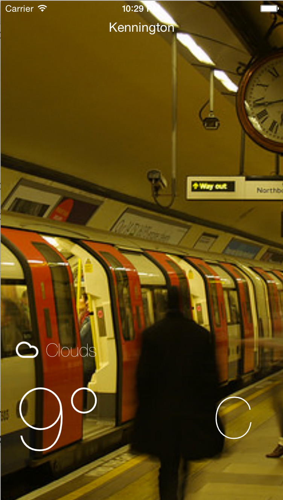

# PlayWeathr
Learning Objective C by building a weather app that knowns your location and gives you the current temperature as well as 7 day forcast. My App also pulls in a Flickr background picture based off of your location! Play around.

## Important

Scroll down to see Daily Forcast

Screenshot
---
<div align="center">
        
</div>

Technologies used
----------
* Objectiv C
* OpenWeather API
* Flickr API
* Xcode
* IOSimulator

How to clone
----
```sh
git clone git@github.com:HannahCarney/PlayWeathrr.git
cd PlayWeathrr
```
How to run locally
----

* [Install Pods](https://cocoapods.org/)

```sh
pod install
```
* [Install XCode](https://developer.apple.com/xcode/downloads/)

* Open XCode and File/Open/PlayWeathrr.xcworkspace
** make sure extension is .xcworkspace NOT .xcodeproj

* Next to "PlayWeathr" at the top, change the iOS devie button to your iPhone simulator of choice (iPhone 5, iPhone 6 for example)

* Make sure the blue PlayWeather on the left is highlighted

* Press the Play Button

* Press YES if app asks to use location services

* Location services can be simulated by clicking PlayWeathr at the top next to the "A", clicking "Edit Scheme", then options and altering the default location. Play around to see the different pictures!

* If App doesn't load go to iOS Simulator and click Reset Content and Settings. Also Command + Option + Shift + K to clean before building.

Challenges
----

I struggled with this as my first time using Objective C. I have only used Xcode very briefly before and so had trouble with set up and with all of the options. Once I understood what I was doing, however, it flowed easier. I found a lot of documentation on the weather API and so it was a perfect way to start learning. I figured out how to debug and use the console to output my work. After I was bored of weather, I decided to try to use the Flickr API for which I couldn't find a single example of location based work. However, I figured it out with a lot of debugging. A hilarious side note is that I kept pulling through "null" as a Flickr tag and the image that would come up was of a bug! I solved that bug, but it was a funny bug indead. Please play around with changing the location on Xcode so as so see the awesome pictures people have taken from around the world.

Me
----
I am [Hannah] from the December 2014 cohort of Makers Academy, London!
[Hannah]:https://github.com/HannahCarney
